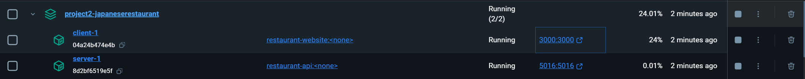

# Running the Docker container:

## `docker compose up --build`
Builds and runs the docker container.

The first run will probably be rather slow as dependencies are added and the volume to enable hot reloading for the React app is mounted.

